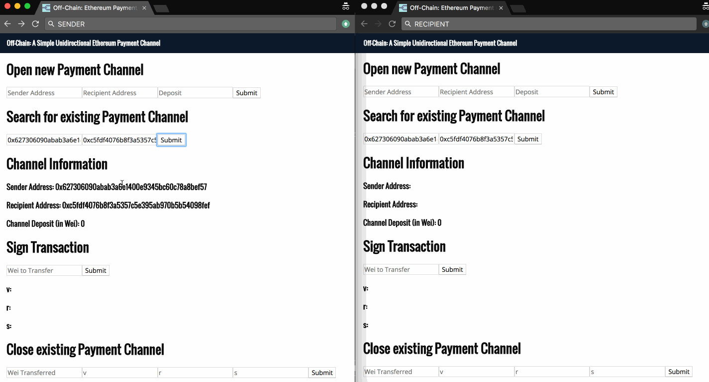

# Off-Chain: A Simple Unidirectional Ethereum Payment Channel




## Installation

1. Install Truffle globally.
    ```javascript
    npm install -g truffle
    ```

2. Install the necessary dependencies.
    ```javascript
    npm install
    ```

3. Run the development console.
    ```javascript
    truffle develop
    ```

4. Compile and migrate the smart contracts. Note inside the development console we don't preface commands with `truffle`.
    ```javascript
    compile
    migrate
    ```

5. To build the application for production, use the build command. A production build will be in the build_webpack folder.
    ```javascript
    npm run build
    ```
    
6. Run the webpack server for front-end hot reloading (outside the development console). Smart contract changes must be manually recompiled and migrated.
    ```javascript
    // Serves the front-end on http://localhost:3000
    npm run start
    ```
